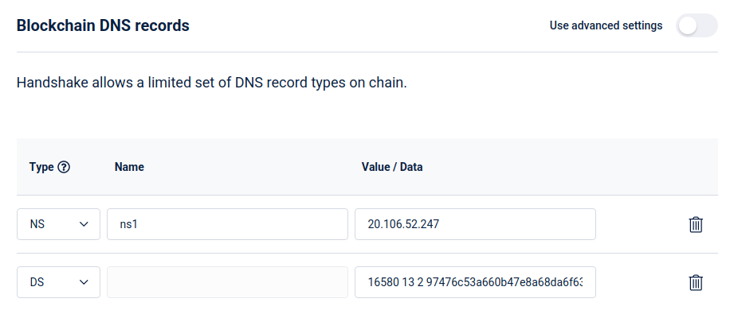

**Posts in this series:**

1. [Introduction]()
2. Part 1 - Set up DNS server (this one!)
3. [Part 2 - Set up Web server]()
4. [Part 3 - Secure with DANE]()

---

# Set up DNS server

We'll be using PowerDNS here. You can use
[bind9](https://www.digitalocean.com/community/tutorials/how-to-setup-dnssec-on-an-authoritative-bind-dns-server-2),
[knot](https://www.knot-dns.cz/docs/2.4/singlehtml/), or any other
authoritative server, but PowerDNS is the (personally) easiest to set up and
use.

> Sebastian Rasor has a similar guide with `nsd`: https://www.sebastianrasor.com/blog/hosting-a-secure-website-on-the-handshake-protocol-using-dane

## Disable Stub Resolver

First things first, Ubuntu comes with systemd's stub resolver listening on port
53, which we'll need to stop / free up.

```sh
# check if the DNS port is already bound to by systemd-resolve
sudo lsof -i :53
# if the output is empty, the stub resolver is already disabled, skip this section.
```

With your favorite text editor, open `/etc/systemd/resolved.conf` with sudo and:

1. Set `DNS=1.1.1.1` (or any other public resolver to be used by the system)
2. Uncomment and set `DNSStubListener=no`

Symlink this file to use systemd's resolv config:

```sh
sudo ln -sf /run/systemd/resolve/resolv.conf /etc/resolv.conf
```

Then reboot the machine with `sudo reboot`. Check with `lsof` again and make
sure `systemd-resolve` is not listed.

> If you see sudo ~~complaining~~ warning about hostname not resolving every
> time it is used, edit `/etc/hosts` to add a line `127.0.0.1 hostname` where
> hostname is the hostname of the machine. This won't affect any commands below
> and is entirely optional.

## Install PowerDNS

This is straight-forward and same as [PowerDNS install
docs](https://doc.powerdns.com/authoritative/installation.html):

```sh
# Add PowerDNS repo from https://repo.powerdns.com/ (select OS, Authoritative Server, latest version)
sudo sh -c "echo 'deb [arch=amd64] http://repo.powerdns.com/ubuntu focal-auth-46 main' > /etc/apt/sources.list.d/pdns.list"
sudo sh -c "echo 'Package: pdns-*\nPin: origin repo.powerdns.com\nPin-Priority: 600' > /etc/apt/preferences.d/pdns"
curl https://repo.powerdns.com/FD380FBB-pub.asc | sudo apt-key add -
sudo apt update

# Install PowerDNS and sqlite3 backend (which is good enough for most cases)
sudo apt install sqlite3 pdns-server pdns-backend-sqlite3 -y
```

The server must have started by now, confirm that the `Active:` is
`active(running)` in green on

```sh
sudo systemctl status pdns
```

## Configure PowerDNS

With the server now installed, we'll update its configuration file
`/etc/powerdns/pdns.conf` and set these fields:

(remember to remove the existing `launch` line in the file)

```
launch=gsqlite3
gsqlite3-database=/var/lib/powerdns/pdns.sqlite3
gsqlite3-dnssec=yes
```

Then,

```sh
# Initialize the sqlite database with schema
sudo sqlite3 /var/lib/powerdns/pdns.sqlite3 < /usr/share/doc/pdns-backend-sqlite3/schema.sqlite3.sql

# Change ownership of the directory to the `pdns` user and group
sudo chown -R pdns:pdns /var/lib/powerdns

# Restart PowerDNS
sudo systemctl restart pdns
```

Make sure there are no errors and the server is running with

```sh
sudo systemctl status pdns
```

At this point, the DNS server is set up and we can add our domain's zone!

## Create zone

A zone is a collection of records belonging to a specific namespace,
in this case, our domain. All records will be added to this new zone that's
going to be created.

> Remember to replace `smartface` with your Handshake domain

```sh
# create an empty zone
sudo -u pdns pdnsutil create-zone smartface ns1.smartface

# enable DNSSEC for the zone
sudo -u pdns pdnsutil secure-zone smartface

# add a TXT record so we can test the DNS server
# Name: @ (root of domain)
# Type: TXT
# Value: "first-record!" (note the single quotes to make bash pass in the double quotes)
sudo -u pdns pdnsutil add-record smartface. @ TXT '"first-record!"'
```

Now try to query the server with `dig` and you should see the TXT record in the
response!

```sh
dig @127.0.0.1 smartface TXT +dnssec
```

> Instead of 127.0.0.1, you can even try it with the public IP address of the
> machine

## Point domain to DNS server

We'll set some DNS records on the blockchain that says "contact `DNS Server` for
records on how to reach content".

The NS record is for pointing to the DNS server, and the other is a DS record that
completes the chain of trust for DNSSEC.

To get the DS record value to add, type in `pdnsutil show-zone smartface` and it
should show a list of keys like:

```
keys:
ID = 1 (CSK), flags = 257, tag = 16580, algo = 13, bits = 256     Active         Published  ( ECDSAP256SHA256 )
CSK DNSKEY = smartface. IN DNSKEY 257 3 13 BmMMTshK2sZmsZwIiX9J0DATWzxN4NJcQnC6/PbRMPHVNh4UrA2RDRY316KTDZCE8dloHiVncH+wK8a6NsoAyw== ; ( ECDSAP256SHA256 )
DS = smartface. IN DS 16580 13 1 68280939f0acdb13defda2080a7865e601159e72 ; ( SHA1 digest )
DS = smartface. IN DS 16580 13 2 97476c53a660b47e8a68da6f6365e87016cd044d2638e33561149203eaf95e75 ; ( SHA256 digest )
DS = smartface. IN DS 16580 13 4 802f39144574b60e4a20b9dcb8e539fb541630153bc236b89cf733c0d8482d72bc2cde8a381b97a9e812df45193ae5e6 ; ( SHA-384 digest )
```

We only need one of these rows. While we could take any one of the DS rows,
SHA256 is good enough (the 2nd last line with "13 2" in it).

We now have all the info that's needed to add records on the blockchain.

> The IP address in the images below must be replaced with your machine's public
> IP address.

### Namebase

If you're using Namebase, then update the Blockchain DNS to look like this:


### Bob Wallet

The NS record can only take hostnames, not IP addresses. One way around this is
to create a glue record on the domain that points `ns1.smartface` ->
`20.106.52.247` and then use that as the value for the NS record. Don't worry if
you don't completely get it, it's just a hack to set an IP address for the NS
record.

So with Bob Wallet (or any other wallet), a GLUE record must explicitly be
added: 

> Note the trailing dot required for the NS record here.

## Wait.

Updates to blockchain DNS are not instantaneous. Handshake stores this data in a
structure called Urkel Tree, which only updates 4 times a day (every ~6 hours)
to save on space and improve performance.

> This is fine because the blockchain is meant to be referral-only and
> should not change frequently. Any DNS record changes (subdomains, etc.) will
> be done on PowerDNS directly and will be much faster (with a default TTL of 5
> minutes).

This tree update takes place at every 36 blocks, so to get an approximate time
when you can expect the changes to go live would be:

```
last_update = (current height % 36) blocks ago
next_update = (36 - last_update) blocks to go
```

Practically, you might need to wait for another block or three.

Query a public handshake resolver (https://hdns.io in this case) for the TXT
record:

```sh
dig @103.196.38.38 smartface TXT +dnssec
```

If the tree update is done, and everything's well, you should see the TXT record
response from the DNS server!

With the DNS server set up, let's move on to [Part 2: Set up the Web
server]().
