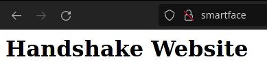

**Posts in this series:**

1. [Introduction]()
2. [Part 1 - Set up DNS server]()
3. Part 2 - Set up Web server (this one!)
4. [Part 3 - Secure with DANE]()

---

# Set up Web Server

In this part, we'll set up a simple nginx server that just serves a static
website. You can also go with any other software like [Apache
httpd](https://httpd.apache.org/) or [lighttpd](https://www.lighttpd.net/).

## Install nginx

```sh
# Install nginx
sudo apt install nginx -y

# create a directory to place website
sudo mkdir -p /var/www/smartface
```

## Add content

Copy your website files into `/var/www/smartface`. For this post, we'll create a
very simple page with one heading:

```sh
# create a basic index.html file
sudo sh -c "echo '<html><body><h1>Handshake Website</h1></html>' > /var/www/smartface/index.html"
```

## Configure nginx

Now, we create a new site in nginx and let it know what files to serve on the
website. Use your favorite text editor and create a file
`/etc/nginx/sites-available/smartface` with this content:

```
server {
  listen 80;
  listen [::]:80;
  root /var/www/smartface;
  index index.html;
  server_name smartface;
  location / {
    try_files $uri $uri/ =404;
  }
}
```

Once this site is created, enable it with:

```sh
sudo ln -s /etc/nginx/sites-available/smartface /etc/nginx/sites-enabled/smartface

# and then restart nginx
sudo systemctl restart nginx

# check status and make sure no errors with
sudo systemctl status nginx
```

Finally, we add a DNS record to the DNS server to make the handshake domain
point to this web server.

If you're following this series, then add the record to PowerDNS:

```sh
sudo -u pdns pdnsutil add-record smartface. @ A 20.106.52.247
```

If you have DNS set up elsewhere, the record to add is:

- Name: @ (root of domain)
- Type: A
- Value: `IP address of the web server`

Now try visiting the domain to see your content!



With the website now resolving and loading in browsers, the last part is to
secure it: [Part 3: Secure with DANE]().
