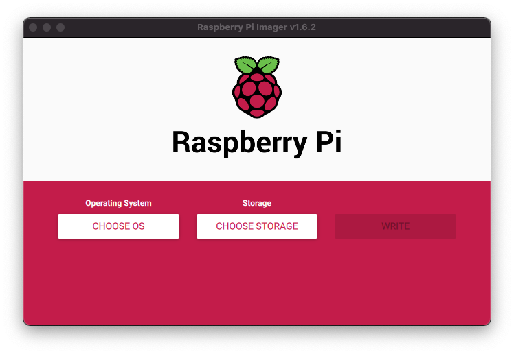
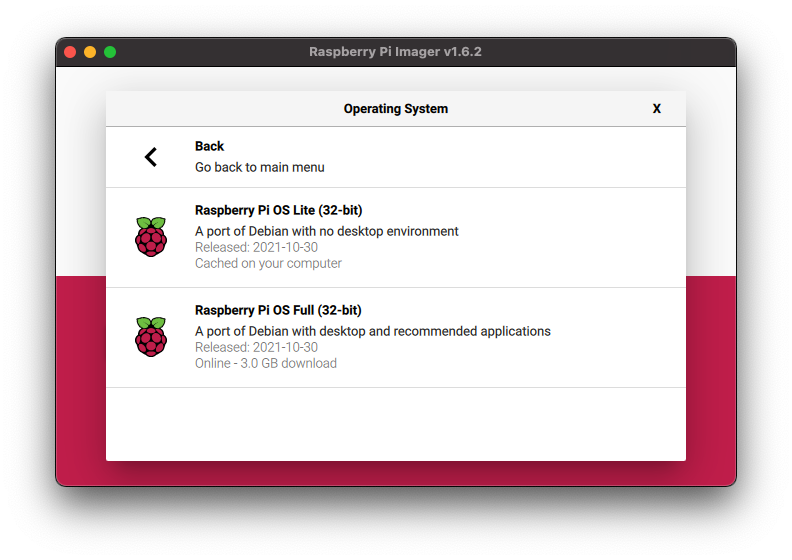
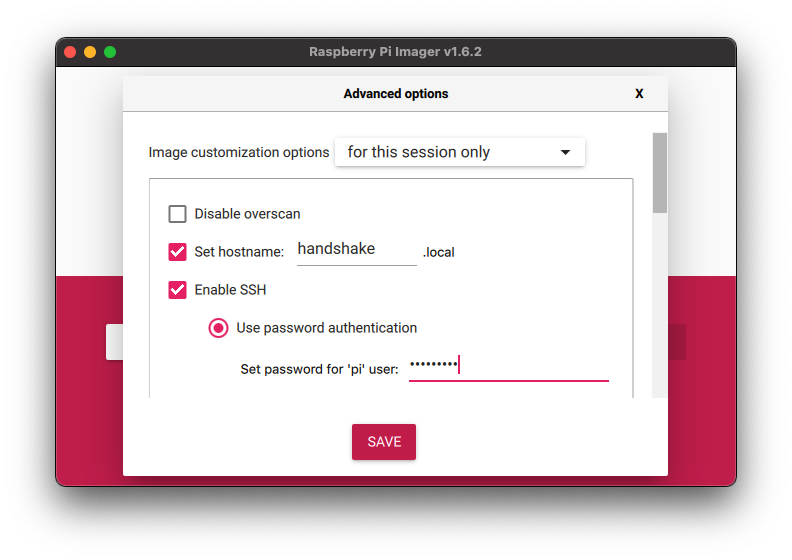

Handshake has a tiny SPV resolver that can run in devices with low specs, such a [Raspberry Pi Zero W](https://www.raspberrypi.com/products/raspberry-pi-zero/).


In this tutorial we will need just the RPi and a SD Card (min 4GB). We also need a SD Card reader (USB or native).

## Raspberry Pi OS

First step is to install the OS in the SD card. Raspberry Pi has a utility called [Raspberry Pi Imager](https://www.raspberrypi.com/software/) that does all the work for us.



Click on "Choose OS" and select "Raspberry Pi OS (other)" then "Raspberry Pi OS Lite (32-bit):



Next, "Choose Storage" and select your SD Card.

Here's a nice trick that will save us some time: in this imager we can set wifi password that RPi will use. 🤯

Press <kbd>Ctrl</kbd> + <kbd>Shift</kbd> + <kbd>X</kbd> (or <kbd>Cmd</kbd> + <kbd>Shift</kbd> + <kbd>X</kbd>)

Note: this next step maybe only available if you are running the imager on a Mac OS. No worries, we can setup wifi manually.


YES!

The imager will ask your username/password, so it can access your wifi's password.



These are the fields I changed:
1. Set hotname: `handshake` (remember to tick the checkbox)
2. Enable SSH
3. Set password for 'pi' user: `handshake` (you can use a stronger password here).
4. Configure wifi
5. SSID: my wifi name
6. Password: my wifi password
7. Wifi country: the 2-letters code for your country.

Save. Click on "Write" and confirm. It may take a while.

Once it's finished, insert the SD Card in the RPi and plug the power cable.

There's no need for screen or keyboard directly in RPi. We can access it remotely.  
Keep in mind that the first time you power the device it will expand the OS inside the SD Card, which may take a while.

After ~5 min, try to connect via ssh:

```sh
ssh pi@handshake.local
```

## Install HNSD

Here's a script with all we need:
```sh
sudo apt update
sudo apt install -y git automake libtool libunbound-dev

git clone https://github.com/handshake-org/hnsd.git
cd hnsd/
./autogen.sh && ./configure && make
```

## Disable default services

By default, the OS comes with some DNS service already enabled.  
Let's disable them and put our own DNS resolver there:

```sh
sudo sed -i '/name_servers/s/^#//g' /etc/resolvconf.conf
sudo sed -i 's/\(option domain_name_servers\).*/\1/g' /etc/dhcpcd.conf
echo 'nameserver 127.0.0.1' | sudo tee /etc/resolv.conf > /dev/null
sudo setcap 'cap_net_bind_service=+ep' /home/pi/hnsd/hnsd
```

## Quick test

We can start hnsd just to make sure everything is working fine.

```sh
./hnsd -p 4 -r 0.0.0.0:53 -d -l /tmp/hnsd.log
```

Which means:
* `-p 4` connect to 4 peers
* `-r 0.0.0.0:53` start the recursive server in this port and accept external requests
* `-d` daemon
* `-l /tmp/hnsd.log` send the output to this file

Once we start hnsd, it will find peers and ask them all the blocks headers.  
This takes between a few seconds to a few minutes to finish.

```sh
tail /tmp/hnsd.log -f | grep "new height"

#output
chain (44715):   new height: 44715
chain (44716):   new height: 44716
chain (44717):   new height: 44717
```

You can check in a [block explorer](https://hnsnetwork.com/) what's the latest block. 

In another terminal window in your computer (not via SSH) try this:
```sh
dig @handshake.local iamfernando +short
```

If you see an IP it worked! 🎉

Back to the SSH window, kill the process
```sh
killall hnsd
```

## Run as a service

Let's make sure hnsd will be executed again after a reboot (or a crash).

```sh
sudo tee -a /etc/systemd/system/hnsd.service > /dev/null <<EOF
[Unit]
Description=Handshake
After=network.target

[Service]
Type=simple
ExecStart=/home/pi/hnsd/hnsd -p 4 -r 0.0.0.0:53
Restart=always

[Install]
WantedBy=multi-user.target
EOF

sudo systemctl enable hnsd.service

# Start!
sudo service hnsd start
```

## Using Your Server

We have now a working DNS server that can resolve Handshake names!  
Next step it to configure your computer (not the RPi) to use it.

We have two options here:
1. Update the DNS settings in each device (desktops, mobiles, TVs...).
2. Update the DNS settings in the router.

Both will work but I can't help you on this configuration because it depends on the devices, OS or router brand/model.  
To configure the DNS you will need the Raspberry Pi's IP

```sh
hostname -I
```

## What now?

Assuming you have already updated the DNS settings of your computer or router you are ready to access domains on Handshake.

Try these:
* http://parking.sinpapeles/ - A list of domains available for sale
* http://iamfernando/ - My personal domain
* http://allhns/ - A lot of useful links about Handshake
* http://hnssearch/ - a search engine for Handshake