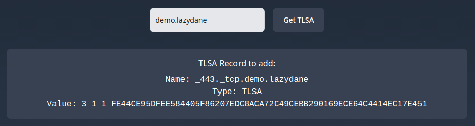

In this guide, we set up a new website on a Handshake domain and secure it with
Stateless DANE. Caddy is the recommended way to set up such websites.

Learn more about [Handshake](https://handshake.org/),
[DANE](https://en.wikipedia.org/wiki/DNS-based_Authentication_of_Named_Entities),
and [Stateless DANE]().

## Install Caddy

This post assumes Ubuntu; for other OS/distros, see Caddy’s [official install
docs](https://caddyserver.com/docs/install).

Install caddy with:

```sh
curl -1sLf 'https://dl.cloudsmith.io/public/caddy/stable/gpg.key' | sudo gpg --dearmor -o /usr/share/keyrings/caddy-stable-archive-keyring.gpg
curl -1sLf 'https://dl.cloudsmith.io/public/caddy/stable/debian.deb.txt' | sudo tee /etc/apt/sources.list.d/caddy-stable.list
sudo apt update
sudo apt install -y caddy
```

> **Temporary note:** until caddy v2.8.0 is released in ~March 2024, it needs to
> be built from source. So if the above installed a newer version of caddy (>
> 2.7.6), skip the rest of this section.

```sh
# Only follow this until caddy 2.8.0+ is released

# Install go
sudo snap install go --classic

# Build caddy from source
git clone https://github.com/caddyserver/caddy.git
cd caddy/cmd/caddy/
go build

# Set up the newly build caddy as an alt to the standard caddy
sudo dpkg-divert --divert /usr/bin/caddy.default --rename /usr/bin/caddy
sudo mv ./caddy /usr/bin/caddy.custom
sudo update-alternatives --install /usr/bin/caddy caddy /usr/bin/caddy.default 10
sudo update-alternatives --install /usr/bin/caddy caddy /usr/bin/caddy.custom 50
sudo systemctl restart caddy

# the above is adapted from https://caddyserver.com/docs/build#package-support-files-for-custom-builds-for-debianubunturaspbian
```

We’ll make sure caddy is running with `sudo systemctl status caddy` before
moving to the next section. The `Active:` line should say **active (running)**.

## Website setup

I won’t go into detail on all the features Caddy offers — they have excellent
[documentation](https://caddyserver.com/docs/caddyfile-tutorial). Instead, we’ll
use the simplest config with the `respond` directive.

Edit the default Caddyfile with your favorite editor:

```sh
sudo vim /etc/caddy/Caddyfile
```

and update the file to look like this:

```caddy
demo.lazydane {
    respond "This is a Handshake website!"
    tls email@address.com {
        reuse_private_keys
        ca https://acme.htools.work/directory
    }
}
```

- Replace `demo.lazydane` with your domain name (can be a bare TLD or SLD)
- Set your email address (does not have to be valid, anything will do)

Then notify caddy to read the new config with:

```sh
sudo systemctl reload caddy
```

## Set TLSA record

The final step is to set the TLSA record, just like a regular DANE website.

To find the record to be set, visit https://acme.htools.work/tlsa and enter your
domain name:



> Another way to find this record is with `openssl`:
> [link](https://gist.github.com/buffrr/609285c952e9cb28f76da168ef8c2ca6?permalink_comment_id=4958955#gistcomment-4958955)

Set this record at your DNS host (PowerDNS, Varo, Namebase, etc.)

Visiting https://demo.lazydane/ should load without warnings (if you are
browsing securely with [Fingertip](https://impervious.com/fingertip)).

As of this point, the website is just secured with regular DANE.

## Where’s Stateless?

Since the certificate needs to include DNSSEC proofs of the TLSA record, they
will only be added after the TLSA record is set.

Now that we’ve set the TLSA record, the next time caddy renews the certificate,
it will get a Stateless DANE certificate.

We could simply wait for ~1.5 days and it would automatically take effect, but
let’s force caddy to renew the certificate now to skip the wait (replace your
domain name):

```sh
sudo rm /var/lib/caddy/.local/share/caddy/certificates/acme.htools.work-directory/demo.lazydane/demo.lazydane.crt
sudo systemctl restart caddy
```

And that’s it! Your website will trustlessly load anywhere Stateleess DANE is
supported.

Now show off your shiny new website in the Handshake groups on
[Telegram](https://t.me/handshake_hns) and
[Discord](https://handshake.org/discord)!
