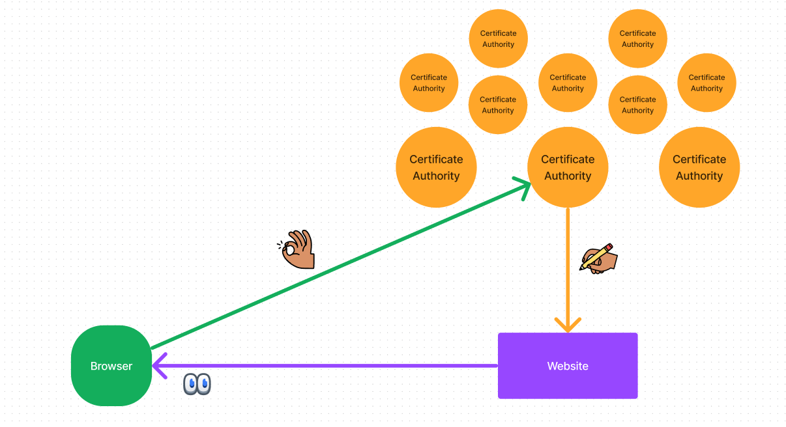
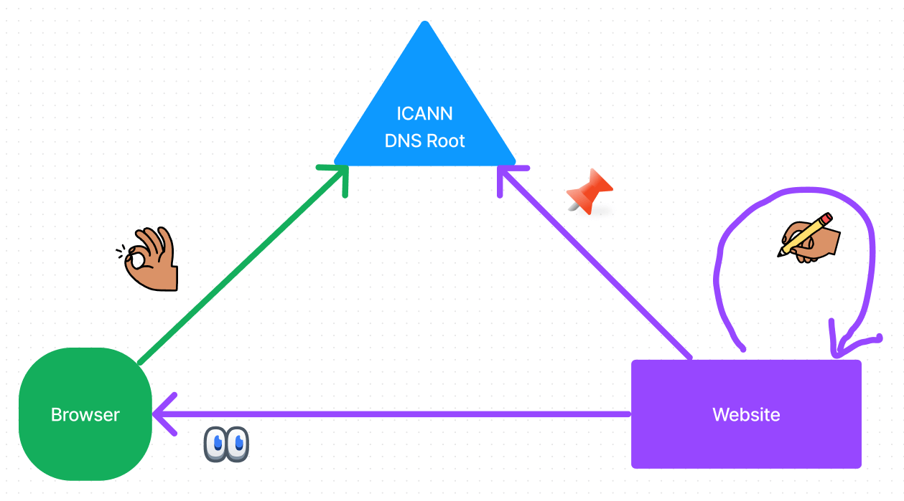
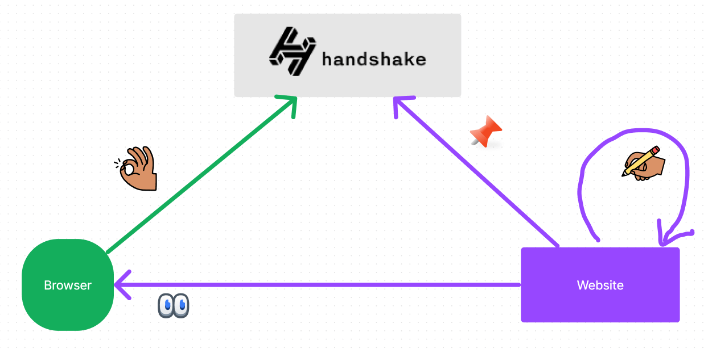
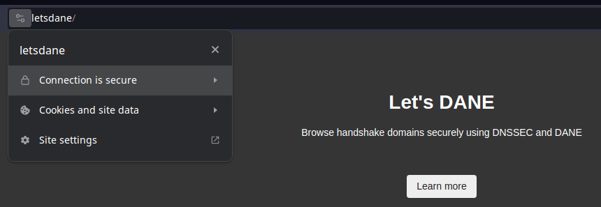
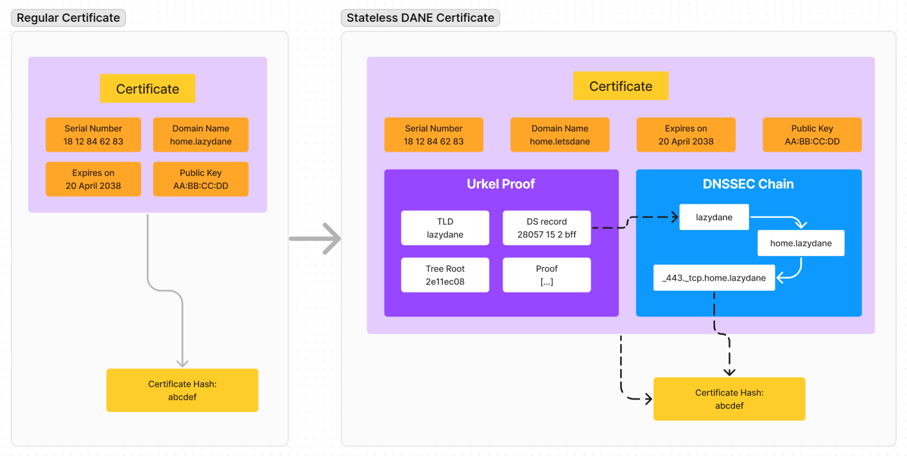
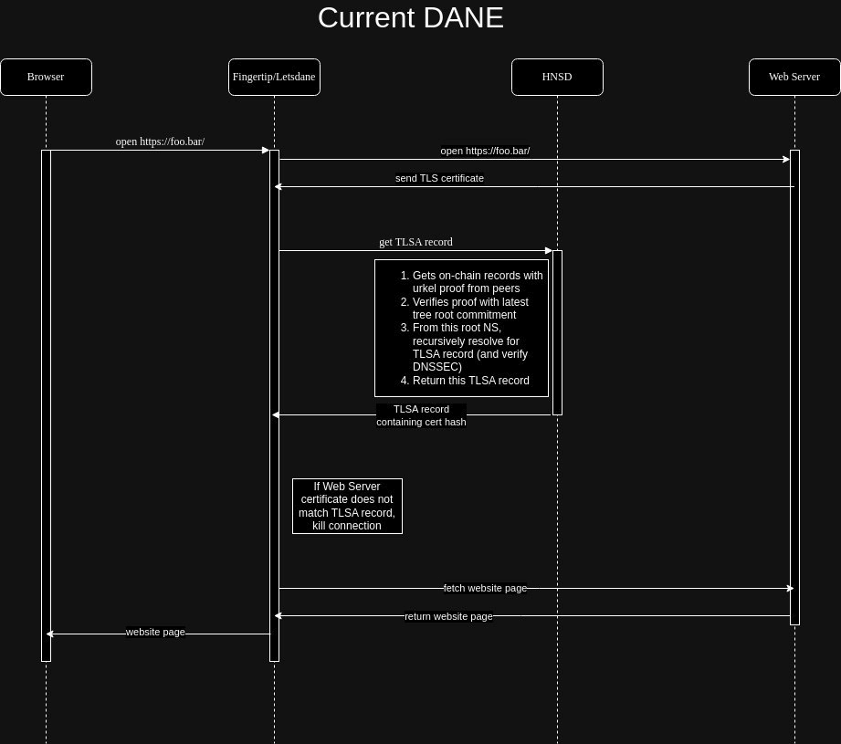
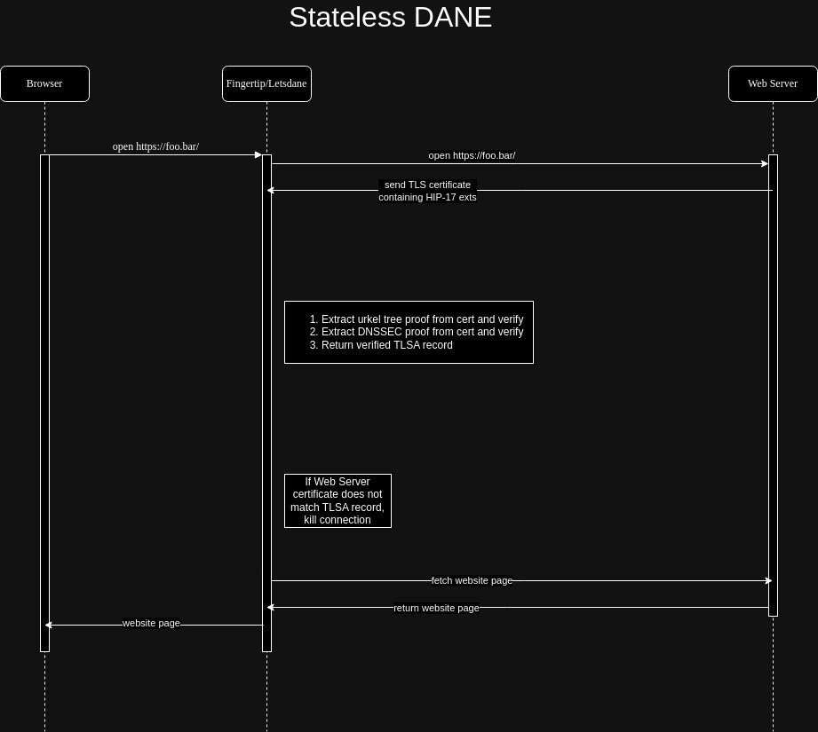

First,

# A bit about DANE

## CAs

Most websites out there are served securely over HTTPS. This is possible with
the help of “trusted” entities called Certificate Authorities (CAs) that issue
certificates to websites. And when you visit any of these websites, the browser
checks if the website has a valid certificate issued by a CA it trusts.

However, this requires everyone to trust CAs to always act responsibly and never
be compromised in any way. If a CA is compromised, this can lead to serious
security issues, like the issuance of fraudulent certificates.

> All operating systems (on phones, desktops, gaming consoles, etc.) and all
> browsers have their own root stores of CAs that are trusted.

While this is currently the best way to secure websites, DNS-based
Authentication of Named Entities
([DANE](https://en.wikipedia.org/wiki/DNS-based_Authentication_of_Named_Entities))
attempts to improve it.

## DANE

To be clear, DANE isn’t exactly new. There are RFCs dating back to 2011. They’ve
also been in use for emails for years.

Here, the whole process of verifying a (TLS) connection with the website remains
the same. But instead of trusting CAs, websites can use any self-signed
certificate. How do you verify it though? Through a chain of trust that leads to
DNS (the “D” in DANE). We won’t go in depth here but the short version is that
we move from “Trust hundreds of CAs” to “Trust DNS”.

Now this has been done before, even for websites — Chrome even ran an experiment
with DANE support a decade ago. But it never took off primarily because, “Trust
DNS” meant you still had to trust another entity if not the CAs — the DNS root
zone that’s managed by ICANN.

## DANE for Handshake

If you haven’t heard of [Handshake](https://handshake.org/), it’s an alternate
DNS root zone that is decentralized and open to everyone. Anyone can own a Top
Level Domain (TLD) and own the entire namespace under it.

The neat thing about Handshake is that it’s “just” DNS. Remember the problem of
trusting a root zone from before? Well, Handshake solves that. The root zone is
secured with proof of work, so with some magic (more details below), DANE can
work completely trustlessly!

This isn’t theoretical. Handshake websites have been secured with DANE since
2020! Try it out for yourself with a secure resolver like
[Fingertip](https://impervious.com/fingertip).

# The Problem

DANE works and is great, but it’s not all sunshine and roses.

- The resolver needs to be **Always On** — The handshake light client that is
  required to fetch and verify root zone records must stay connected to peers.
  It doesn’t take up a lot of resources on desktops, but becomes more noticable
  on phones and embedded computers where every mAh counts for a longer battery
  life.
- This also means that volunteer full nodes are required to help these
  resolvers. Running these are fairly cheap (a ~$20/mo cloud machine takes care
  of several hundred clients) but **costs** nonetheless.
- Resolving from peers is **Slow**. It’s usable, but the overhead of querying
  multiple peers, waiting and verifying everything takes a bit of extra time,
  compared to the regular way.

Browsers interested in integrating Handshake usually find these issues as
barriers and sometimes blockers to add Handshake support.

# “Stateless”

A new proposal [HIP-17](https://hsd-dev.org/HIPs/proposals/0017/) aims to solve
this with Stateless DANE. Stateless simply means that the app running on users’
devices doesn’t have to stay connected to other nodes.

Everything required to verify the connection will be provided by the website
itself.

But verifying proof of work will need _some_ kind of reference to the blockchain
right? So the app will, in the background, connect to peers and quickly sync
like a light client. This will only take a ~5 seconds a day, which is a
significant improvement over staying connected all day.

# How it works

There are 2 kind of proofs required for DANE with Handshake:

- Urkel Proofs - Proof of on-chain records for a TLD, including trust anchors
- DNSSEC Chain - A chain of signatures for a TLSA record, leading up to the
  trust anchor

The TLSA record stores what certificates can be trusted.

By linking these two proofs, we get a full chain of trust right from the
blockchain to the certificate from the website. We can be sure that the owner of
the TLD has allowlisted this certificate to be used.

In regular DANE, urkel proofs are requested from peers and DNSSEC chain is
generated by the app running on the user’s device.

### Stateless DANE Certificates

Since we’re trying to do away with peers, in S-DANE, both these proofs are
embedded in the certificate itself! i.e. the certificate contains everything it
needs to prove itself.

The Urkel Proof proves the trust from the blockchain to the TLD. The DNSSEC
chain continues from the TLD to the website certificate. And the certificate
contains both these proofs. See the cycle completing?

# How this helps

- Always On - the app doesn’t need to stay connected anymore, making it
  friendlier for phones and embedded devices.
- Cost - full nodes don’t have to help light clients with resolving DNS queries
  anymore.
- Slow - by using public handshake resolvers, the cache level moves one level up
  and is shared by many users. Also, each user doesn’t have to make multiple DNS
  queries to verify the DNSSEC chain.

# More details

We can break up what the client side app does in two:

1. Resolving Handshake - finding the website for a domain
2. Verifying the connection - securely connect to the website

Regular DANE requires the client app to handle both. Stateless DANE reduces the
burden on clients by outsourcing both resolution and proof creation to a public
resolver and the website it is trying to reach, respectively.

If you’re still curious about how the whole S-DANE process differs from regular
DANE in practice, these flowcharts might help:

| Regular DANE                                                 | Stateless DANE                                                   |
| ------------------------------------------------------------ | ---------------------------------------------------------------- |
|  |  |

# What’s next

Stateless DANE is still new, resolvers and integrations are still being built.
This post will be updated once they’re ready.

In the mean time, try [setting up your own Stateless DANE website]() and share your thoughts on it!
